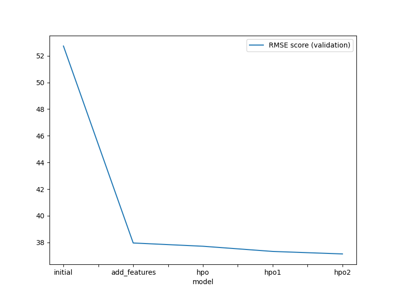
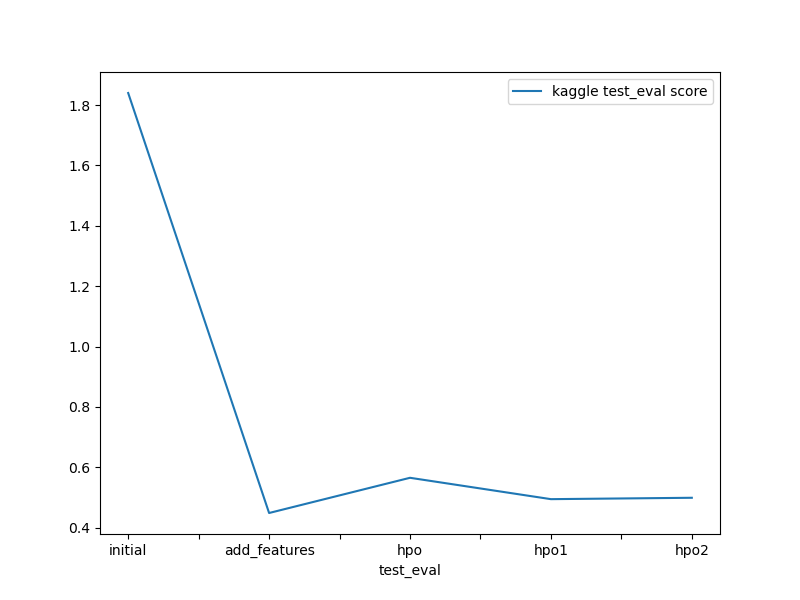

# Report: Predict Bike Sharing Demand with AutoGluon Solution
#### Ramin Roufeh

## Initial Training
### What did you realize when you tried to submit your predictions? What changes were needed to the output of the predictor to submit your results?
TODO: we had to make sure there is no negative value and if there is any negative value we turn it to zero

### What was the top ranked model that performed?
TODO: The top-ranked model was the (add features) model named WeightedEnsemble_L2, with a validation RMSE score of 37.963095 and the best Kaggle score of 0.44883 (on test dataset). 

## Exploratory data analysis and feature creation
### What did the exploratory analysis find and how did you add additional features?
Features like season and weather are categorical variables.

Bike rental counts for feature season intuitively makes sense as the counts are highest for 0: Spring and lowest for 3: Winter

Predictors like holiday and workingday are one-hot encoded columns with values 0 and 1.

datetime histogram illustrates datetime feature, showing randomness as they represent timestamps

features like temp, atemp, humidity and windspeed depicts normal distribution. windspeed shows a slightly 'positively-skewed distribution'.

casual and registered independent feature histogram plots are ignored as they are invalid for our analysis, since they are absent in the test dataset.

Variation is seen on hourly basis. So splitting the 'datetime' feature into year, month, day (dayofweek) and hour respectively.

### How much better did your model preform after adding additional features and why do you think that is?
TODO: I was able to improve model score from 1.84007 to 0.44883 by adding additional features.
adding additionel features like hour and day of the week, because it gives more additionel details to our model

## Hyper parameter tuning
### How much better did your model preform after trying different hyper parameters?
TODO: model performance with hyper parameters gives 0.55799 which was better than initail model but it was not bettre than additional features model

### If you were given more time with this dataset, where do you think you would spend more time?
TODO: I would work more on hyper parameter optimizationand adding more features

### Create a table with the models you ran, the hyperparameters modified, and the kaggle score.
|model|hpo1|hpo2|hpo3|score|
|--|--|--|--|--|
|initial|prescribed_values|prescribed_values|"presets: 'high quality' (auto_stack=True)"|1.84007|
|add_features|prescribed_values|prescribed_values|"presets: 'high quality' (auto_stack=True)"|0.44883|
|hpo (top-hpo-model: hpo1)|Tree-Based Models: (GBM, XT, XGB & RF)|KNN|"presets: 'optimize_for_deployment"|0.49469|

### Create a line plot showing the top model score for the three (or more) training runs during the project.

### Create a line plot showing the top kaggle score for the three (or more) prediction submissions during the project.

## Summary
The top-ranked model was the (add features) model named WeightedEnsemble_L3, with a validation RMSE score of  37.963095 and the best Kaggle score of 0.44883 (on test dataset)
